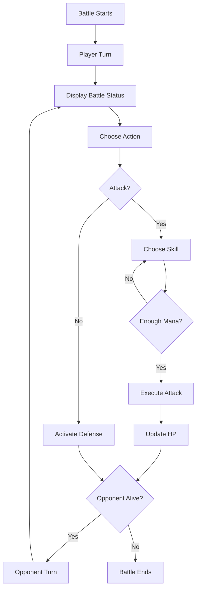
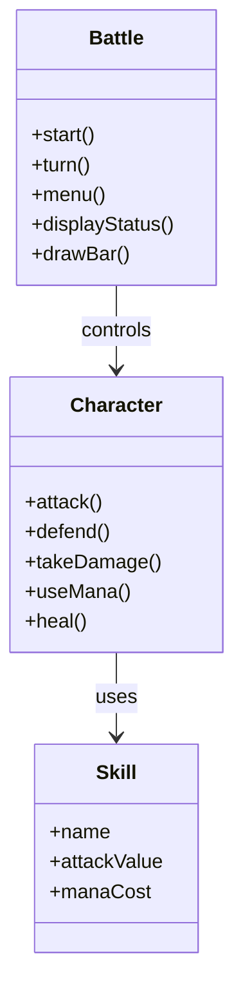
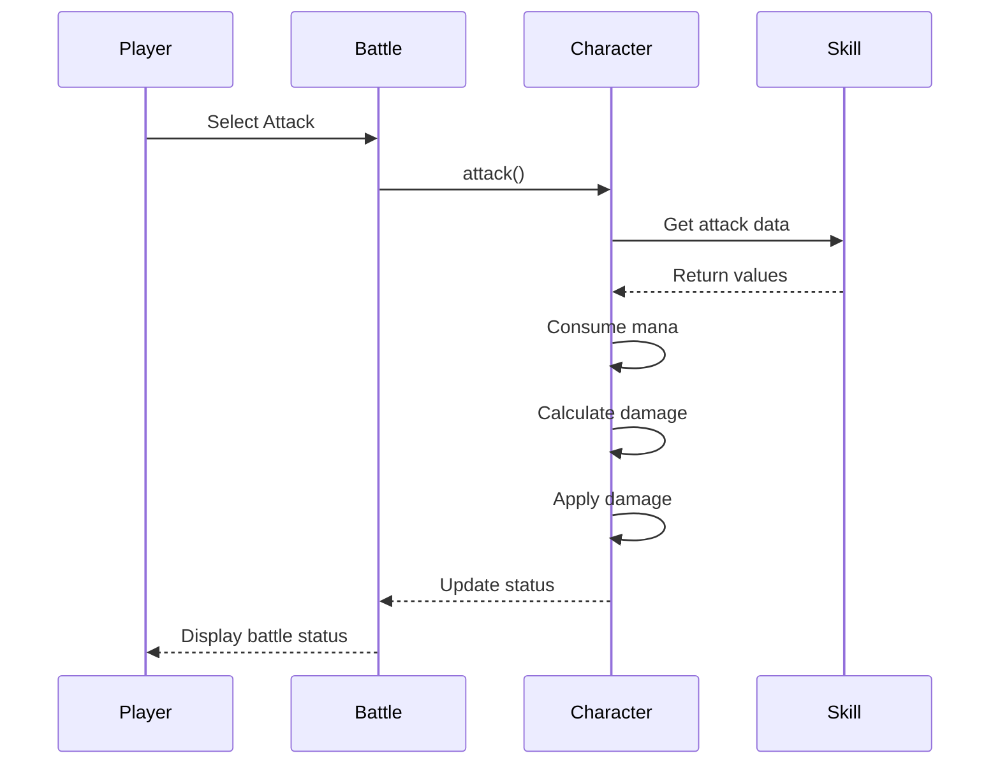

# ⚔️ Turn-Based Battle Game

> A turn-based battle game developed in **C++**, focused on applying Object-Oriented Programming concepts and clean software design.

---

# 📖 Overview

This project implements a turn-based combat system using Object-Oriented Programming principles. Each class has a single responsibility, making the code modular, maintainable, and easy to extend.

The project was created as a study of OOP concepts such as encapsulation, composition, association, const correctness, and object interaction.

---

# ✨ Features

- Turn-based battle system
- Skill-based attacks
- Defense mechanic
- Mana management
- Mana validation before skill execution
- Visual HP bars
- Visual MP bars
- Battle status displayed every turn
- Automatic winner detection

---

# 🔄 Battle Flow



---

# 🏛️ Architecture

The project is divided into three main classes, each responsible for a specific part of the battle system.



---

# 🔁 Attack Sequence



---

# 📂 Project Structure

```text
turn-based-battle-game/
│
├── README.md
├── LICENSE
├── .gitignore
│
├── Battle.cpp
├── Battle.hpp
│
├── Character.cpp
├── Character.hpp
│
├── Skill.cpp
├── Skill.hpp
│
└── main.cpp
```

---

# 📚 Classes

## Battle

Responsible for controlling the entire combat flow.

### Responsibilities

- Manage turn order
- Display battle status
- Read player actions
- Finish the battle

---

## Character

Represents a combatant.

### Responsibilities

- Store character attributes
- Attack
- Defend
- Receive damage
- Consume mana
- Manage health and mana

---

## Skill

Represents an ability that can be used during battle.

### Responsibilities

- Store skill name
- Store attack value
- Store mana cost
- Define skill type

---

# 💡 Object-Oriented Programming Concepts

| Concept | Application |
|----------|-------------|
| Encapsulation | Private attributes accessed through getters and controlled methods. |
| Association | `Battle` coordinates two `Character` objects. |
| Composition | Each `Character` owns a collection of `Skill` objects. |
| Abstraction | Each class models a specific entity of the battle system. |
| Const Correctness | Read-only methods and constant parameters improve code safety. |
| References | Prevent unnecessary object copies during combat. |

---

# 🚀 Compilation

```bash
g++ *.cpp -o game
```

---

# ▶️ Run

```bash
./game
```

---

# 💻 Example Output

```text
=====================================
         BATTLE STARTS!
=====================================

========== BATTLE STATUS ==========

Archangel
HP [====================] 100
MP [********************] 60

Leviathan
HP [====================] 100
MP [********************] 70

=====================================
```

---

# 🔮 Future Improvements

- [ ] Graphical interface (SDL3)
- [ ] Inventory system
- [ ] Status effects
- [ ] Artificial Intelligence
- [ ] Sound effects
- [ ] Animations
- [ ] Level progression
- [ ] Additional skills
- [ ] Save and load system

---

# 🛠️ Technologies

- C++17
- Object-Oriented Programming
- GNU G++
- Makefile

---

# 📄 License

This project is licensed under the MIT License. See the `LICENSE` file for more information.