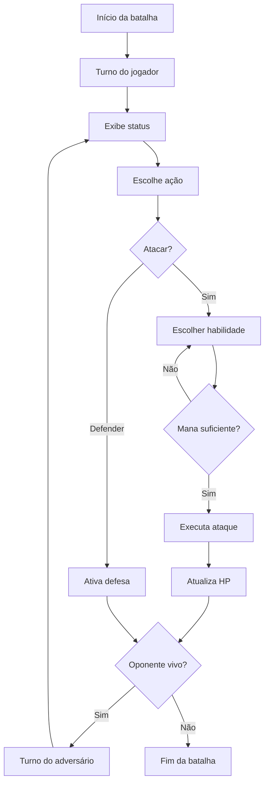
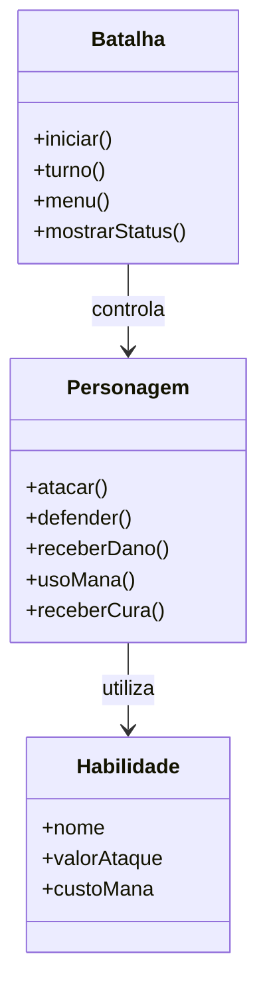
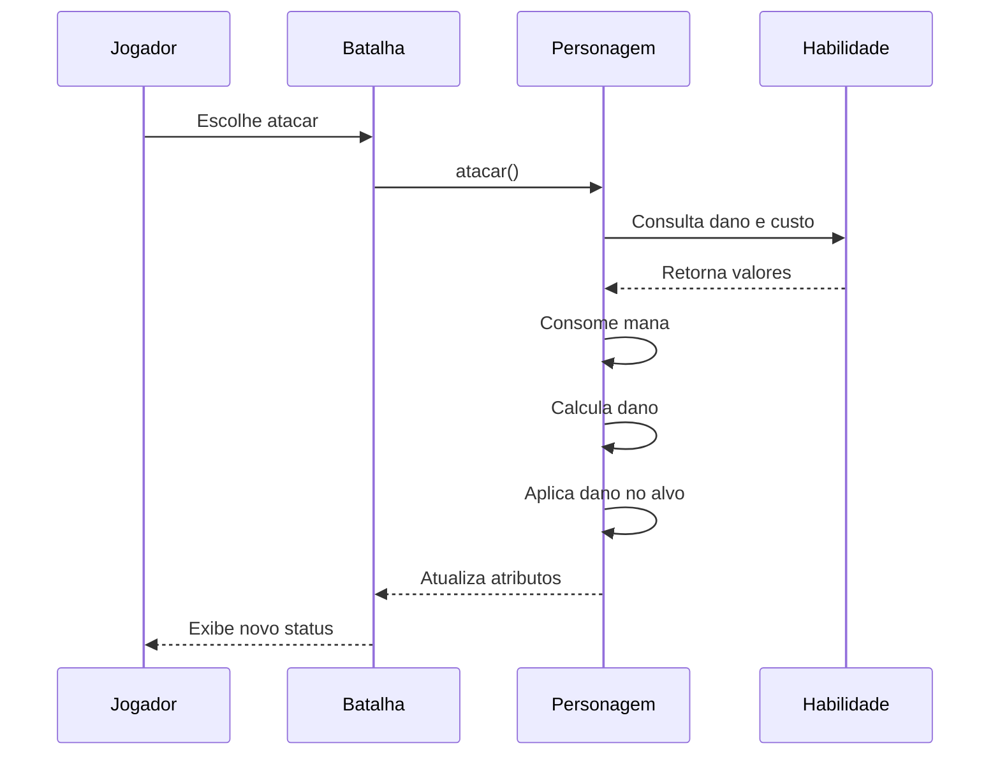

# ⚔️ Turn Game

> Jogo de batalha por turnos desenvolvido em C++ com foco na aplicação de Programação Orientada a Objetos.

---

# 📖 Visão Geral

O projeto implementa um sistema de combate em turno utilizando conceitos de Programação Orientada a Objetos, separando responsabilidades entre classes para facilitar manutenção, expansão e reutilização do código.

---

# ✨ Funcionalidades

- Sistema de batalha por turnos.
- Sistema de ataque utilizando habilidades.
- Sistema de defesa.
- Sistema de mana.
- Validação de mana antes da execução de habilidades.
- Barras visuais de HP.
- Barras visuais de MP.
- Exibição do estado da batalha a cada turno.
- Determinação automática do vencedor.

---

# 🔄 Fluxo Geral da Batalha



---

# 🏛️ Arquitetura

O projeto é dividido em três classes principais, cada uma responsável por uma parte específica do sistema.



---

# 🔁 Sequência de um Ataque



---

# 📂 Estrutura do Projeto

```text
Turn-game/
│
├── README.md
│
└── game/
    ├── main.cpp
    ├── Batalha.cpp
    ├── Batalha.hpp
    ├── Personagem.cpp
    ├── Personagem.hpp
    ├── Habilidade.cpp
    ├── Habilidade.hpp
    └── Makefile
```

---

# 📚 Classes

## Batalha

Responsável por controlar toda a lógica do combate.

### Principais responsabilidades

- Alternância de turnos.
- Exibição do estado da batalha.
- Leitura das ações do jogador.
- Encerramento da partida.

---

## Personagem

Representa um combatente.

### Principais responsabilidades

- Armazenar atributos.
- Atacar.
- Defender.
- Receber dano.
- Consumir mana.
- Gerenciar vida e mana.

---

## Habilidade

Representa uma habilidade utilizável durante o combate.

### Principais responsabilidades

- Nome.
- Valor de ataque.
- Custo de mana.

---

# 💡 Conceitos de POO Aplicados

| Conceito | Aplicação |
|----------|-----------|
| Encapsulamento | Todos os atributos privados acessados por getters e setters. |
| Associação | A classe `Batalha` trabalha com objetos `Personagem`. |
| Composição | Cada `Personagem` possui um conjunto de `Habilidade`. |
| Abstração | Cada classe representa uma entidade específica do domínio. |
| Const | Métodos que não alteram estado e parâmetros constantes. |
| Referências | Evitam cópias de objetos durante o combate. |

---

# 🚀 Compilação

```bash
g++ *.cpp -o jogo
```

---

# ▶️ Execução

```bash
./jogo
```

---

# 💻 Exemplo

```text
=====================================
         A LUTA COMEÇA!
=====================================

========== STATUS DA BATALHA ==========

Arcanjo
[====================] 100 HP
[********************] 100 MP

Leviathan
[====================] 100 HP
[********************] 100 MP

=======================================
```

---

# 🔮 Melhorias Futuras

- [ ] Interface gráfica.
- [ ] Sistema de inventário.
- [ ] Efeitos de status.
- [ ] Inteligência Artificial.
- [ ] Sons.
- [ ] Animações.
- [ ] Sistema de níveis.
- [ ] Novas habilidades.
- [ ] Salvamento de progresso.

---

# 📄 Licença

Projeto desenvolvido para fins de estudo e prática de Programação Orientada a Objetos em C++.