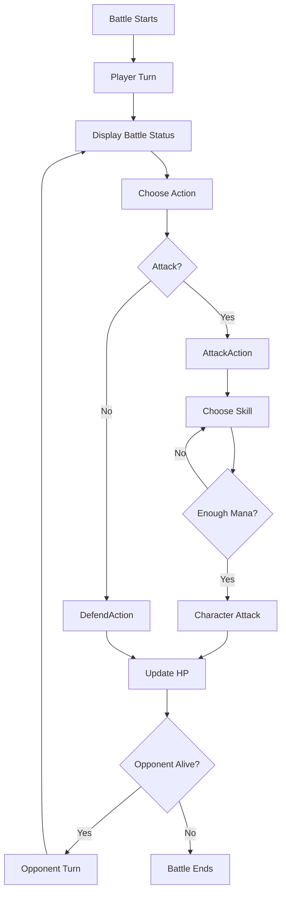
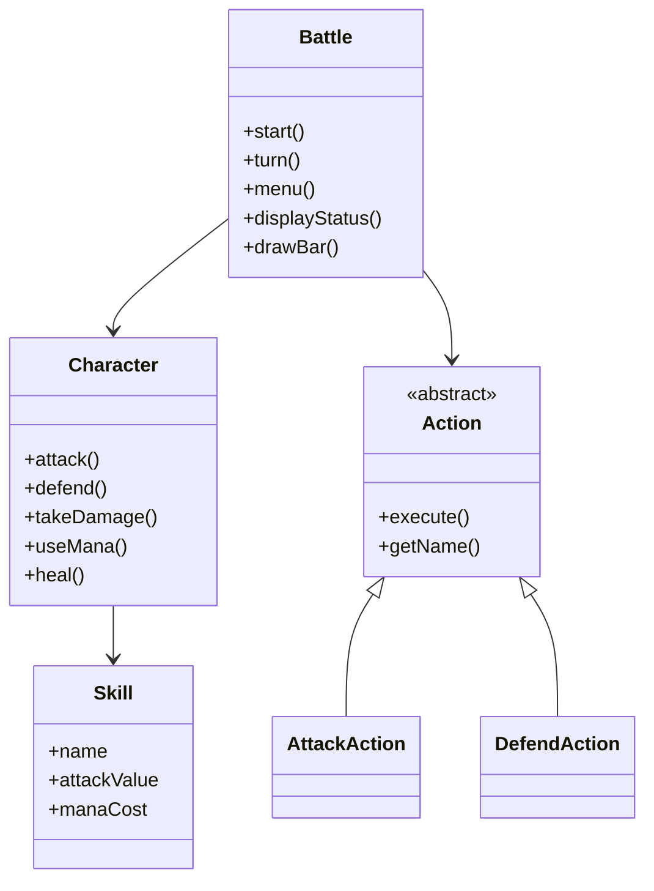
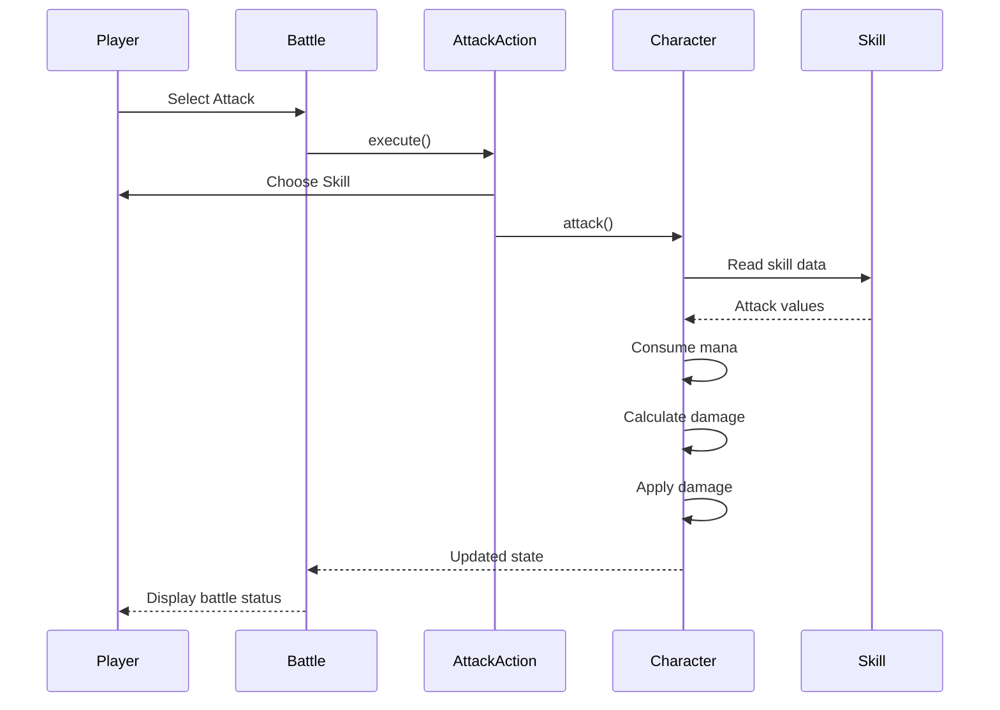

# ⚔️ Turn-Based Battle Game

> A turn-based battle game developed in **C++**, focused on applying Object-Oriented Programming principles, clean software architecture, and extensible game design.

---

# 📖 Overview

This project implements a modular turn-based combat system using Object-Oriented Programming concepts.

The architecture separates the responsibilities of the battle controller, characters, skills, and player actions, making the project easier to maintain and extend.

The project was created as a study of:

- Object-Oriented Programming
- SOLID principles (especially Single Responsibility)
- Polymorphism
- Dynamic dispatch
- Clean software architecture
- Modern C++ practices

---

# ✨ Features

- Turn-based battle system
- Skill-based attacks
- Defense mechanic
- Mana management
- Mana validation before skill execution
- Visual HP bars
- Visual MP bars
- Battle status displayed every turn
- Automatic winner detection
- Action system using polymorphism

---

# 🔄 Battle Flow



---

# 🏛️ Architecture



---

# ⚔️ Action System

The project uses an abstract **Action** class to represent any action that can be executed during a character's turn.

Each concrete action encapsulates its own behavior.

Current implementations:

- AttackAction
- DefendAction

This architecture allows new actions to be added without modifying the battle flow.

Future actions may include:

- ItemAction
- EscapeAction
- MagicAction
- SummonAction

---

# 🔁 Attack Sequence



---

# 📂 Project Structure

```text
turn-based-battle-game/
│
├── CMakeLists.txt
├── README.md
├── LICENSE
├── .gitignore
│
├── include/
│   ├── Battle.hpp
│   ├── Character.hpp
│   ├── Skill.hpp
│   │
│   └── Actions/
│       ├── Action.hpp
│       ├── Actions.hpp
│       ├── AttackAction.hpp
│       └── DefendAction.hpp
│
├── src/
│   ├── Battle.cpp
│   ├── Character.cpp
│   ├── Skill.cpp
│   ├── Game.cpp
│   ├── main.cpp
│   │
│   └── Actions/
│       ├── AttackAction.cpp
│       └── DefendAction.cpp
│
└── build/
```

---

# 📚 Classes

## Battle

Controls the combat flow.

### Responsibilities

- Manage turn order
- Display battle status
- Read player actions
- Execute selected actions
- Finish the battle

---

## Character

Represents a combatant.

### Responsibilities

- Store character attributes
- Attack
- Defend
- Receive damage
- Consume mana
- Manage health and mana

---

## Skill

Represents a combat ability.

### Responsibilities

- Store skill name
- Store attack value
- Store mana cost
- Define skill type

---

## Action

Abstract base class representing any executable battle action.

### Responsibilities

- Provide a common interface
- Enable runtime polymorphism
- Allow new actions without modifying Battle

---

## AttackAction

Concrete implementation responsible for:

- Displaying available skills
- Validating skill selection
- Validating mana
- Executing attacks

---

## DefendAction

Concrete implementation responsible for:

- Activating the defensive state

---

# 💡 Object-Oriented Programming Concepts

| Concept | Application |
|----------|-------------|
| Encapsulation | Private attributes accessed through getters and controlled methods. |
| Association | Battle coordinates Character objects. |
| Composition | Character owns a collection of Skill objects. |
| Abstraction | Action defines a common interface for every action. |
| Polymorphism | Battle executes actions through Action pointers. |
| Dynamic Dispatch | AttackAction and DefendAction override execute(). |
| Const Correctness | Read-only methods improve code safety. |
| References | Prevent unnecessary object copies during combat. |

---

# 🚀 Build

Configure the project:

```bash
cmake -S . -B build
```

Compile:

```bash
cmake --build build
```

Clean and rebuild:

```bash
cmake --build build --clean-first
```

---

# ▶️ Run

```bash
./build/game
```

---

# 💻 Example Output

```text
=====================================
        BATTLE STARTS!
=====================================

========== BATTLE STATUS ==========

Archangel
HP [====================] 100
MP [********************] 60

Leviathan
HP [====================] 100
MP [********************] 70

=====================================
```

---

# 🔮 Future Improvements

- [ ] Graphical interface (SDL3)
- [ ] Artificial Intelligence
- [ ] Inventory system
- [ ] Status effects
- [ ] Sound effects
- [ ] Animations
- [ ] Level progression
- [ ] Additional actions
- [ ] Additional skills
- [ ] Save and load system

---

# 🛠️ Technologies

- C++17
- CMake
- GNU G++
- Object-Oriented Programming
- Polymorphism
- Docker

---

## Docker

This project includes a Docker environment for building and running the game
with Ubuntu 26.04, CMake, C++ build tools and SDL3.

### Build the Docker image

From the project root, run:

```bash
docker build -t turn-based-battle-game .

# 📄 License

This project is licensed under the MIT License. See the `LICENSE` file for more information.